# Diagrams

Entity-relationship, class, architecture, use-case and navigation diagrams for
all three components. Rendered with Mermaid (GitHub renders these inline; or
paste into https://mermaid.live).

---

## 1. grid-analysis — dataset ER diagram

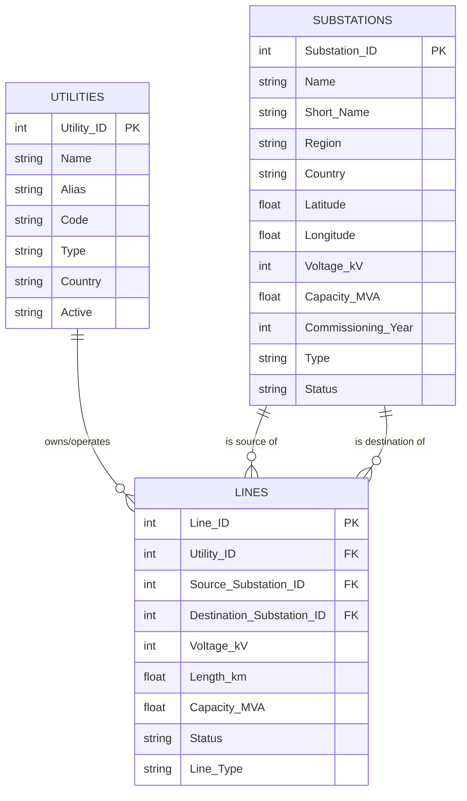

See also `grid-analysis/er_diagram.md` and `grid-analysis/data_dictionary.md`.

### grid-analysis pipeline (data-flow)

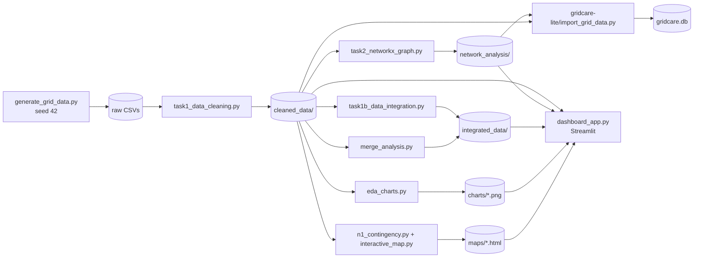

---

## 2. GridCare-Lite

### 2.1 ER diagram

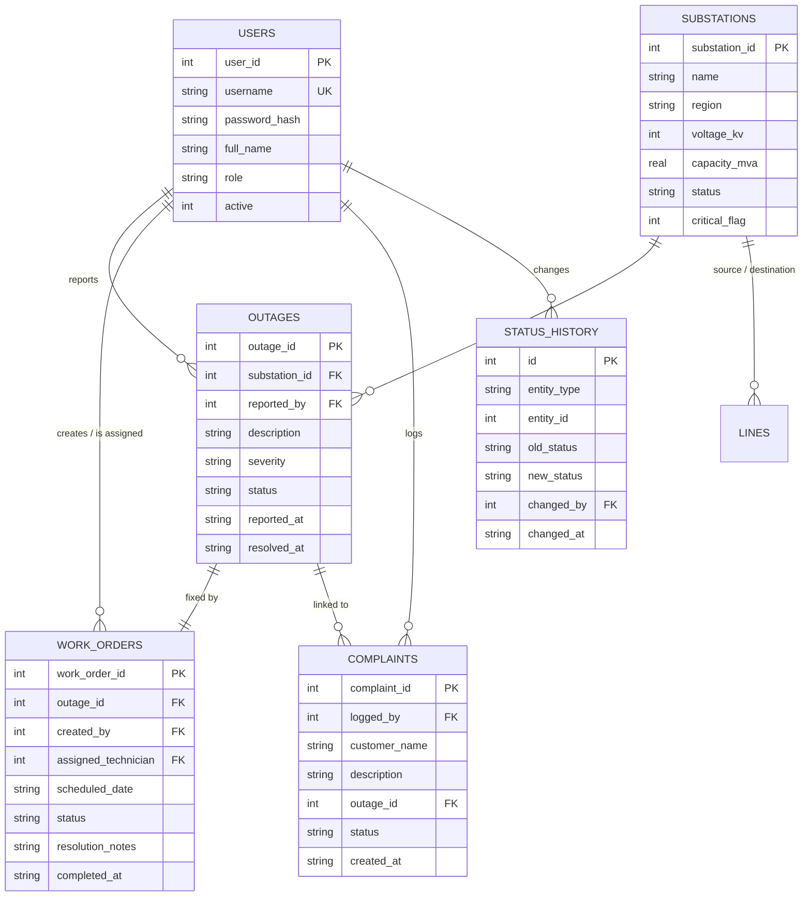

### 2.2 Class / module diagram

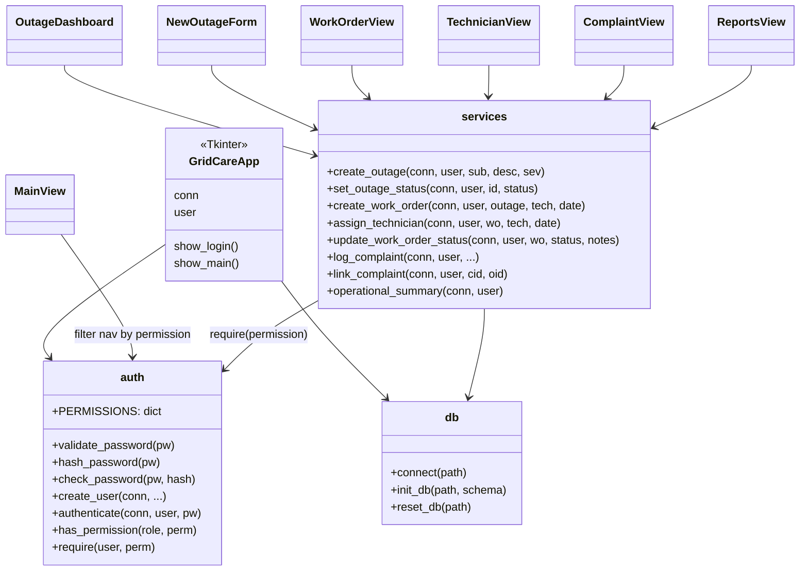

### 2.3 Use-case diagram

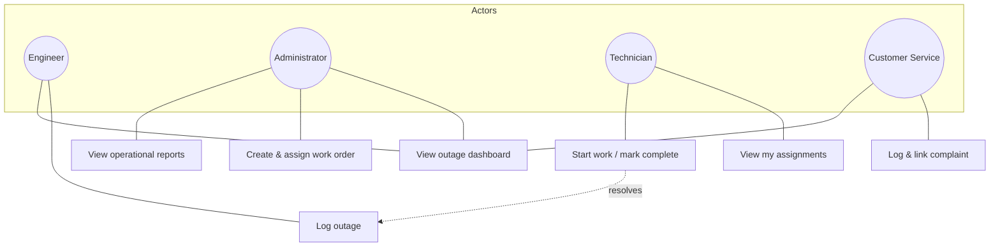

### 2.4 Outage-to-resolution state machine

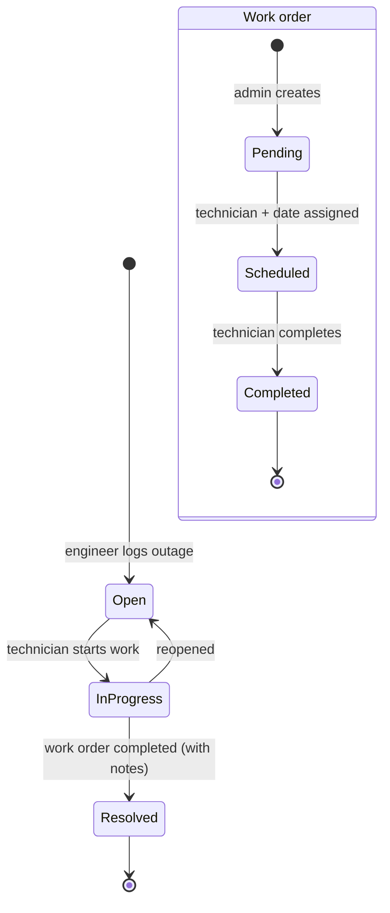

---

## 3. ClinicCare-Lite

### 3.1 Data model (JSON collections)

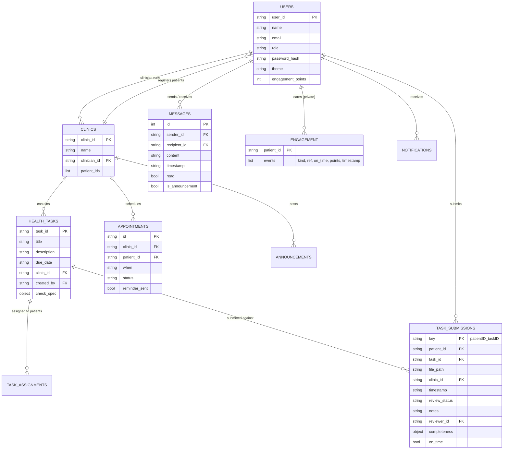

### 3.2 Class diagram

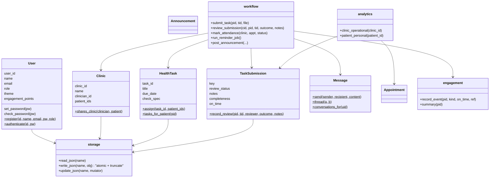

### 3.3 System architecture

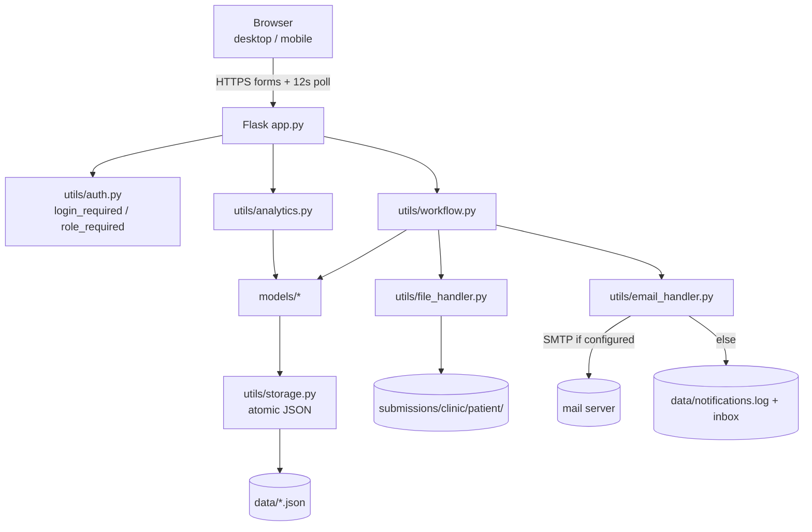

### 3.4 Use-case diagram

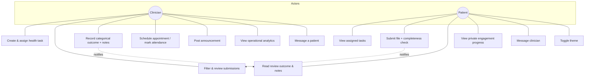

### 3.5 Task-to-review state machine

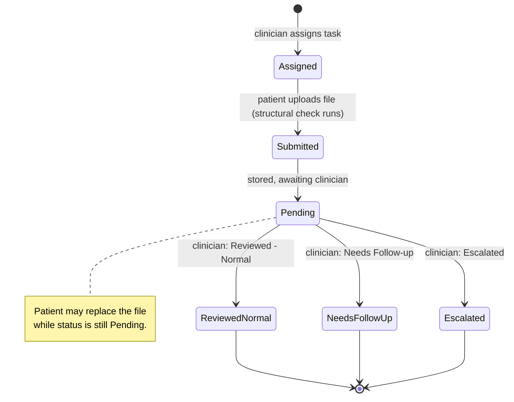

### 3.6 Navigation map

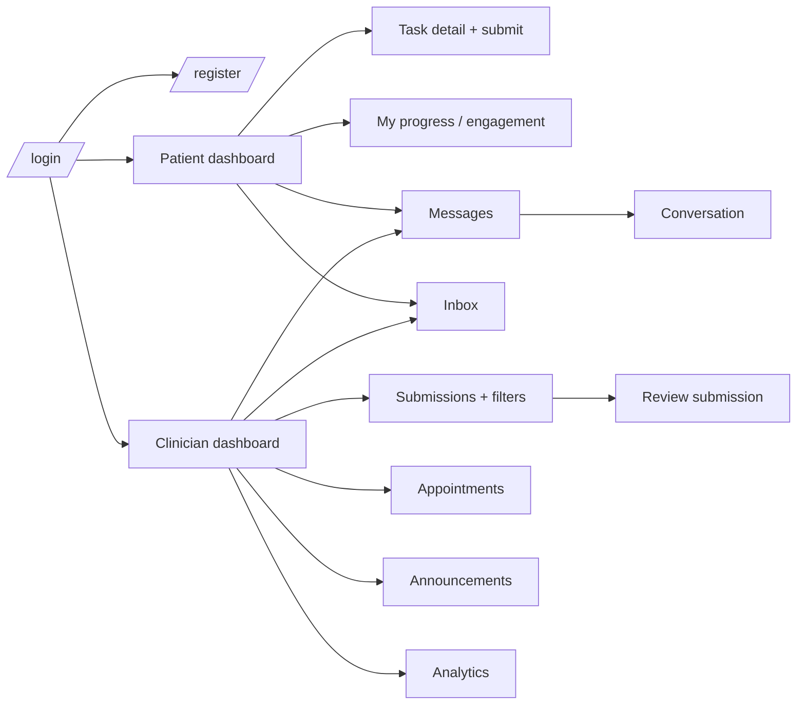
