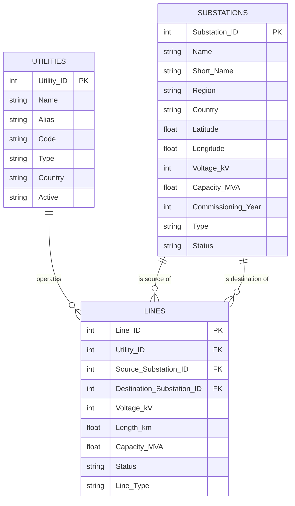

# Entity-Relationship Diagram — Grid Datasets

Relationships between the three raw/cleaned datasets. This is the data model behind
`task1_data_cleaning.py` and `task1b_data_integration.py` — not to be confused with the
separate GridCare-Lite application schema (a different set of tables, covered in that
component's own ER diagram once designed).

## Notes

- `LINES.Utility_ID` → `UTILITIES.Utility_ID` (many lines per utility).
- `LINES.Source_Substation_ID` and `LINES.Destination_Substation_ID` both → `SUBSTATIONS.Substation_ID`
  (two foreign keys into the same table — a line always connects exactly two substations).
- No self-loops: `Source_Substation_ID != Destination_Substation_ID` for every line
  (validated in `data_cleaning_report.md` §7).
- Every foreign key validated with 0 orphans (`data_cleaning_report.md` §7,
  `integrated_data/integration_report.md` §2).
- Substations do not carry a direct `Utility_ID` column — utility ownership of a
  substation is inferred transitively, through the lines that touch it (see
  `task2_networkx_graph.py`, node attribute `utilities`).
