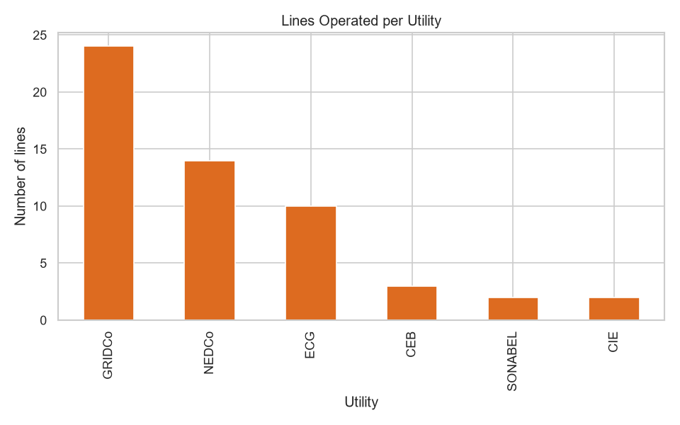
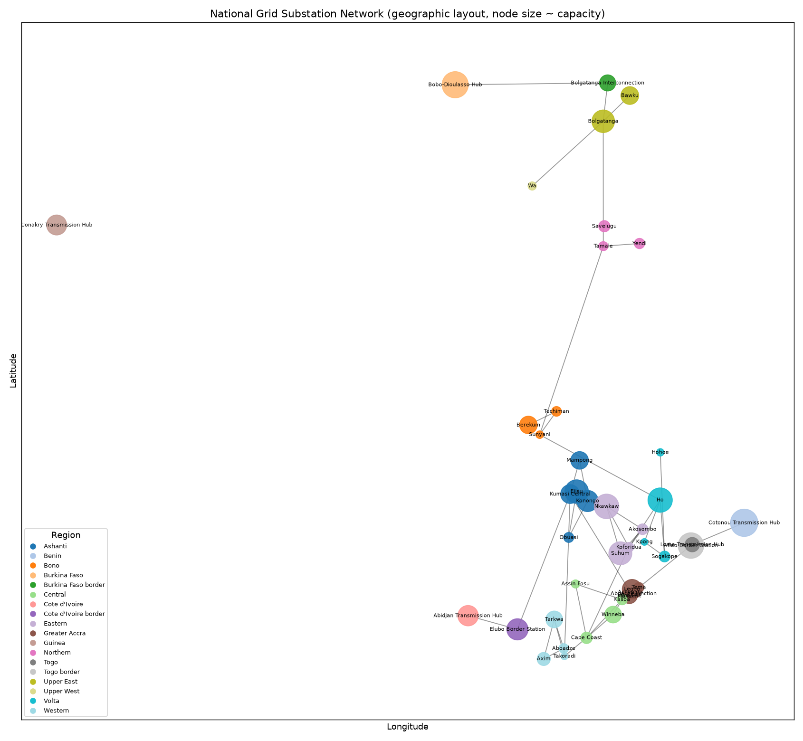

# National Grid Analysis · GridCare-Lite · ClinicCare-Lite

**CS 112 — Computer Programming for CS · Summer 2026**
Cohort A · Team 3

Nana Kojo Atta-Benyah · Brian Edem Bedzrah · Shawn Tei Kpoti · Nana Ekow Amuah

github.com/Nana-Kojo801/cs-final-project

<!-- Speaker notes: one analytical component + two applications, sharing auth/RBAC/testing conventions. -->

---

## The problem

- No clean public dataset of substation-level grid topology for Ghana
- Real patient data can't be used in coursework
- **Solution:** a seeded synthetic dataset (`random.seed(42)`) + fictional demo accounts
  - Every result reproducible, nothing confidential exposed
  - Still exercises the full lifecycle: data → analysis → design → build → test → document

---

## Three components

| | grid-analysis | GridCare-Lite | ClinicCare-Lite |
|---|---|---|---|
| Focus | Data science + network science | Software eng. + DB | Secure web app + privacy |
| Stack | pandas, NetworkX, Folium, Plotly, Streamlit | Tkinter + SQLite | Flask + JSON |
| Output | Reports, charts, interactive map, dashboard | Desktop outage-management GUI | Clinic admin & comms web app |

Shared: bcrypt auth, role-based access control, state machines, automated tests, markdown reports.

---

## Part 1 — The dataset

- 10 utilities · 44 substations · 55 lines
- Real geography + real utility names (ECG, NEDCo, GRIDCo, VRA)
- Synthetic coordinates, capacities, years, connections
- WAPP cross-border interconnections (Burkina Faso, Côte d'Ivoire, Togo, Benin)

**Cleaning (Task 1):** 0 missing, 0 duplicates, **0 orphaned foreign keys**
— the *validation code* is the deliverable, not the empty defect list.

---

## EDA highlights

- Greater Accra has the most substations (6); Ashanti next (5)
- 161 kV most common voltage level
- **GRIDCo operates 24 / 55 lines** — the transmission backbone
- Capacity is right-skewed: median ≈ 108 MVA, max 506 MVA
- 96% of lines Active, 2 under maintenance

---

## Network model

- Undirected graph: 44 nodes, 55 edges
- Built from substation **IDs** → reveals **3 connected components**
  (a name-keyed graph hides the 2 isolated substations — *DEF-02*)
- Highest betweenness: **Cape Coast (0.53)**, Takoradi, Kumasi Central
- 10 communities ≈ administrative regions + cross-border clusters
- **21 of 55 edges are bridges** — global efficiency only 0.24

---

## N-1 contingency analysis

Remove one component, measure fragmentation.

| Remove | Result |
|---|---|
| Kumasi Central substation | +3 fragments, 15 substations cut from main grid |
| Cape Coast / Takoradi | 2 fragments, ~20 substations cut |
| Mallam / Legon (peripheral) | no extra fragmentation |
| **21 of 55 single lines** | **split the network** |

**This grid is radial-leaning — not topologically N-1 secure.**
Recommendation: build loops around the bridge corridors.
*(Graph topology only — ignores load flow, thermal limits, protection.)*

---

## Visualisation

- Static network diagram (geographic, node size ∝ capacity)
- **Interactive Folium map** — substation + line layers, voltage colour-coding, maintenance highlighting
- Plotly scatter-geo map
- **Streamlit dashboard** — Overview / Network / Geography / Reliability / Search

---

## Part 2 — GridCare-Lite

Role-based **Tkinter + SQLite** outage & maintenance management.

Roles: **administrator · engineer · technician · customer-service**

- RBAC in the service layer **and** DB constraints — not just hidden buttons
- State machines: `Open→In Progress→Resolved`, `Pending→Scheduled→Completed`
- Every transition writes a `status_history` audit row
- Substations imported from grid-analysis → outages only against real assets
- "Critical substation" flag from betweenness centrality (labelled a structural proxy)

---

## GridCare-Lite — the workflow

1. Engineer logs an outage against a substation
2. Admin creates + assigns a work order (technician + date)
3. Technician starts work → outage `In Progress`
4. Technician completes with mandatory notes → work order `Completed`, outage **auto-Resolved**
5. Customer-service logs + links a complaint
6. Reports screen recomputes open counts + average resolution time

Invalid input (bad date, empty field, wrong role, duplicate, bad transition) → clear message, never a crash.

---

## Part 3 — ClinicCare-Lite

Secure **Flask** clinic administration & communication. Roles: **clinician · patient**.

- 8-digit IDs (clinician `…0000`, patient `…2022–2028`), password complexity, **bcrypt**
- Sessions + `login_required` / `role_required`; 403 on cross-role access
- Health task → file submission → structural check → **categorical** review → notify
- Appointments, reminders, announcements, secure messaging, analytics

**Administrative & communication only — never diagnoses, scores, or recommends treatment.**

---

## ClinicCare-Lite — privacy by design

- Patient sees **only their own** tasks, submissions, messages, engagement, analytics
- `message.thread()` returns messages only where you're a participant
- Engagement tracker is **private** — no leaderboard, no `rank_patients` (asserted by a test)
- Clinician review/download gated by `shares_clinic(clinician, patient)`
- File handling: extension allow-list, 2 MB cap, **path-traversal blocked**
- Structural completeness check: *"the 'date' column is missing"* — **never** *"your reading is high"*

---

## Testing

| Suite | Tests | Result |
|---|---|---|
| GridCare-Lite | 24 | all pass |
| ClinicCare-Lite | 28 | all pass |
| **Total automated** | **52** | **green on `main`** |

Plus a 57-case manual test plan executed by ≥ 2 members.

**5 defects found & fixed** (all with regression tests): JSON truncation,
name-keyed graph, work-order→outage propagation, cross-technician updates,
missing template filter.

---

## What we learned

- Enforce rules in a **service layer**, not the UI
- Write the regression test **the moment** you find the bug
- Treat "clean" data as untrusted anyway
- Our first N-1 hypothesis was **wrong** — we kept the finding and explained it
- Staying non-diagnostic takes active restraint — the "obvious" feature is the forbidden one

---

## Live demo

1. grid-analysis: interactive map + N-1 chart + Streamlit dashboard
2. GridCare-Lite: engineer → admin → technician → resolved; then a role-access rejection
3. ClinicCare-Lite: clinician assigns task → patient submits (with a completeness flag) →
   clinician reviews → patient sees outcome → private engagement view →
   a cross-patient access attempt → 403

---

## Future work

- **grid-analysis:** real load/outage time-series; capacity-weighted contingency; animated grid growth
- **GridCare-Lite:** multi-user server backend, SLA timers, crew scheduling
- **ClinicCare-Lite:** patient self-scheduling, WebSocket messaging, real database, deployment hardening (CSRF, rate limiting)

---

## Thank you

**Cohort A · Team 3**
Questions?

github.com/Nana-Kojo801/cs-final-project
